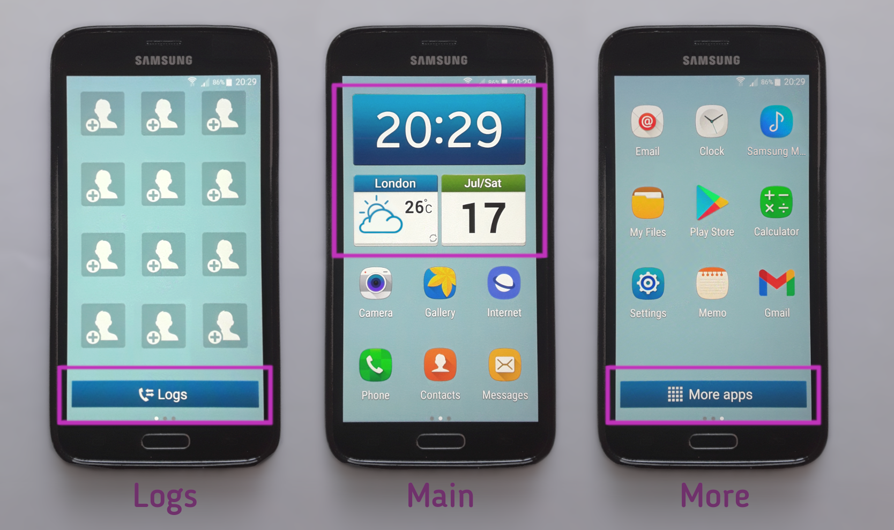
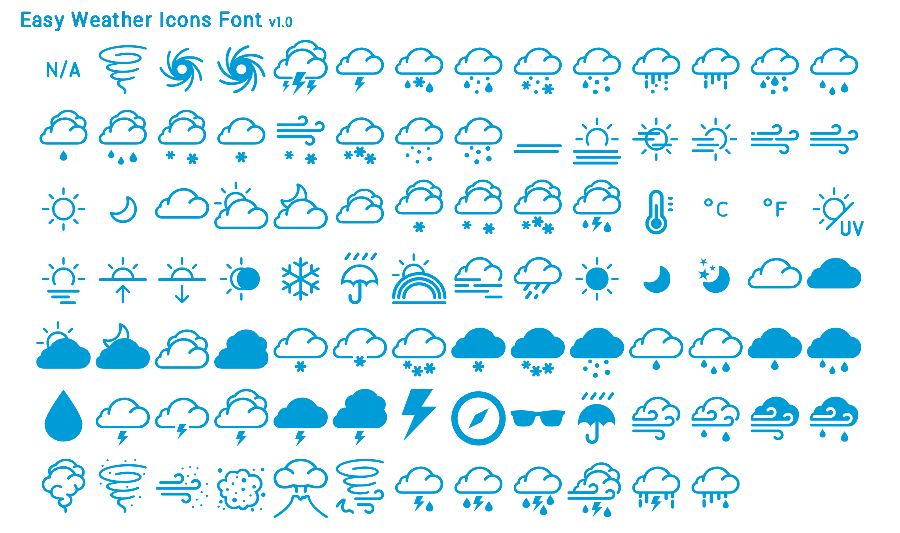

# Easy Mode Replica Widgets

These three widgets help to replicate Samsung's Easy Mode (Galaxy S4 mini version) onto a large variety of newer or replacement android phones for people who like the simplicity of this layout or might find changing to a new one difficult (the setup is done using the KWGT Kustom Widget Maker app and some optional extra settings with Nova Launcher).

You can also just use the 'Main' one on its own with KWGT as a simple clock/weather widget.

 

Shown here working on my Samsung Galaxy S5, but should work on any phone that can use the KWGT app.

## Files included:
* easy_mode_replica_widget_main.kwgt
* easy_mode_replica_widget_logs.kwgt
* easy_mode_replica_widget_more.kwgt
* folder of additional_files

 

[Download .zip](https://github.com/boxbot6/easy-mode-replica-widgets-v1.0/raw/main/downloads/easy-mode-replica-widgets-v1.0.zip)

 

## To use:
Install [KWGT Kustom Widget Maker app](https://play.google.com/store/apps/details?id=org.kustom.widget&gl=US) on your phone from the Google Play Store (to optimally install the widgets use the pro version - or see the 'Without Pro workarounds' further below for use with the free version).

- #### With Pro:
  - Download the .zip file and unzip it.
  - Move the .kwgt files to your phones internal storage folder Kustom/widgets.
  - On your phone find a home screen with some free space and create a new widget by long-pressing an empty area on the screen and select the Widgets prompt that appears at the bottom.
  - Scroll through the widgets and choose the Kustom Widget group.
  - Then choose the KWGT 1 x 1 template (not KWGT Action 1 x 1) and drag it to the free space on your screen and create the blank widget.
  - If the sizable borders are not shown long-press the widget to resize.  
  - Resize the new widget by dragging its' borders to match the dimensions of the widget layout sizes below - (basically make the widgets fill the width of the screen and make the height proportional for the main widget and fixed at 1 icon height for the buttons.
  - Click on the blank widget to set it up - this will open KWGT where you can select the Library at the bottom and then scroll down until you find the widget you want and then press it to add the contents to the blank widget.
  - Save by pressing the floppy disk icon at the top on the editing screen that appears.
  - Repeat for all 3 widgets.

#### Widget Layout Sizes:
 - Main widget 3x2 icons (on high-res phones 4x3) (large phones 5x4) - match the screens number of horizontal icons and make the height proportional.
 - Logs widget 3x1 icons (on high-res phones 4x1) (large phones 5x1) - match the screens horizontal icons, keep the height fixed to 1 icon.
 - More apps widget 3x1 icons (on high-res phones 4x1) (large phones 5x1) - match the screens horizontal icons, keep the height fixed at 1 icon.

(If the created widgets look odd or don't fit your screen size as expected - dependent on the aspect ratio of your device it is possible the imported items may not fill the width of the blank widgets correctly - if this happens please experiment by recreating the widgets again but with slightly different aspect ratios than those used above).

 

 - If Nova Launcher is installed it permits you to more accurately resize and locate the widgets after you make them - you can set the widget borders at 1/2 icon height so that they fit the buttons tighter without leaving space above and below and allowing for better placement of them on the screen (if not 1 icon height is fine, the widgets will just be placed further apart).

 

  The widgets were made initially to work for my Samsung Galaxy S5 (as shown above) which has Nova Launcher installed to customise the look and the BBC weather app that opens on pressing the weather side of the main widget (so it may be a good idea to install those on your phone as well - see details in Additional Setup below).

  The widgets happily work on many other phones, however please note that as there are so many different makes/models of phone and versions of android that not every feature may work instantly with your phone and so you will probably have to use KWGT to re-open the widgets and edit if any glitches appear for your own device (eg. change what the touch actions on the widgets do (or don't do), adjust the widget size, layouts etc.) - please refer to online examples for using KWGT - I've given a typical example below of how to change a touch action. 

#### Example to change a touch action for use on a different phone:

For the Main widget - open the calendar when the date is pressed.

e.g. On a Samsung Galaxy A40 the calendar is opened by using the Calendar app, however on a Samsung Galaxy S5 the calendar is opened using the S Planner app.

   - By default when the date 'Shape' rectangle is pressed the widget opens: TOUCH>Launch App>Calendar - so on a Samsung Galaxy A40 this works OK without any change needed at all. 
   - To edit for use on a Samsung Galaxy S5 - use KWGT to open and change the widgets TOUCH action for the date 'Shape' rectangle to: TOUCH>Launch App>S Planner.

(Note: as you can see here, even the same brand of phone has differences between models so nothing is universal for these settings I'm afraid - you may have to do a little research to find out what works for your device).

   - #### How do I know what to use for my phone?
     - To see what touch actions will work on your device - use KWGT to edit a widget and scroll through the options listed in the SHAPE>TOUCH>Action>(sub-menus) - here you will find the available options specific to your device.
     -  You may have difficulty accessing some of the system features which can be restricted on many phones, so for functions like 'call logs', 'more apps' or other system actions and you might have to install a third-party app like Nova Launcher and then use alternatives like Nova Actions in the Action menu. e.g. TOUCH>Launch Shortcut>Nova action>App drawer for a list of other installed apps to replicate the Samsung system 'More apps'.
     - For ease try to copy actions that already work in other apps or widgets on your device.
     - Dependent on your phone/android version/apps you have installed, you may need to experiment to find alternative targets on your device or search online to find apps with targets or actions that do similar things to those you want to replicate, but don't get too obsessed with exactly recreating everything - remember these widgets may visually look like Samsungs operating system but they are only widgets that run on top of your own operation system so be realistic about exactly replicating all the easy mode features on every other phone or tablet - they may be restricted or not available on your device - you can always turn off the touch actions for features that you can live without by using TOUCH>Action>None.

 

### Additional Setup For The Easy Mode Look:
  - Set the easy mode light-blue background wallpaper (samsung-easy-mode-wallpaper.jpg) from the download's additional_files/easy_mode_replica_widgets_(backgrounds) folder.
  - Install BBC weather app (default target of pressing the weather symbol side of the main widget) or use KWGT to edit and change the TOUCH>Launch App>(target) for the weather 'Shape' rectangle to open the weather app of your choice (or set TOUCH>Action>None to dissable it - likewise to dissable any of the other touch actions).
  - Download and install Nova Launcher app if you don't already have it installed - with this you can set the phones icon grid dimensions, resize and locate the widgets more accurately, edit the Home screen, change the button actions, lock the layout, change the icons, etc. etc. - please refer to online examples for how use all the additional features of Nova Launcher.
    - Sample settings for the Easy Mode look with Nova Launcher - use the following settings for Home Screen:

      Desktop grid: 4 x 3  
      Icon layout: 150%, Labels: On  
      Padding: None x None  
      Dock: Enable: Off  

    - If Nova Launcher is installed it permits you to more accurately resize and locate the widgets after you make them - you can set the widget borders at 1/2 icon height so that they fit the buttons tighter without leaving space above and below and allowing for better placement of them on the screen (if not 1 icon height is fine, the widgets will just be placed further apart).
    - With Nova Launcher installed you should be able to access and add the 'Favourite Contacts' widget to the first page from the phones home screen widgets prompt (resize it upwards slightly to allow for the Logs button widget to fit at the bottom). 

- Home button:

  - Nova Launcher allows you to set a physical Home button to open Recent Apps with a double-press.
  - Alternatively you can install the 'Buttons remapper' app (I used Version 1.19.0) to set a physical Home button to open Recent Apps with a long-press as on the original Galaxy S4 easy-mode.
  - or just leave 'as is' on your device.

 

- #### Without Pro workarounds - a couple of things you can try: (Tested on KWGT version 3.58b):
  - Download the .zip file and unzip it.
  - Move the .kwgt files to your phones internal storage folder Kustom/autosave.
  - On your phone find a home screen with some free space and create a new widget by long-pressing an empty area on the screen and select the Widgets prompt that appears at the bottom.
  - Scroll through the widgets and choose the Kustom Widget group.
  - Then choose the KWGT 1 x 1 template (not KWGT Action 1 x 1) and drag it to the free space on your screen and create the blank widget.
  - If the sizable borders are not shown long-press the widget to resize.  
  - Resize the new widget by dragging its' borders to match the dimensions of the widget layout sizes further above - (basically make the widgets fill the width of the screen and make the height proportional for the main widget and fixed at 1 icon height for the buttons.
  - Click on the blank widget to set it up - this will open KWGT where you can select Backups at the bottom (hopefully contains your files masquerading as backups in the autosave folder where you put them above) - scroll through the widgets to find those you moved there and press the one you want to try to add it to the blank widget.
  - Save by pressing the floppy disk icon at the top on the editing screen that appears.
  - Repeat for all 3 widgets.
  - Probably won't be necessary but you will also have to add **all the files** contained in the downloads (fonts) and (icons) folders to the devices Kustom/fonts and Kustom/icons folders respectively if you are copying or creating new widets. 

  or

  - Very time consuming but you could open each .kwgt file by unzipping it (it's just a renamed .zip file), open the file inside called 'preset.json' in a text editor (Notepad) and manually copy all the module settings shown there to a new KWGT widget made using the free version of KWGT (as you are making a new widget here you will also need to add **all the files** contained in the downloads (fonts) and (icons) folders to the devices Kustom/fonts and Kustom/icons folders respectively and also load the background images for the widgets from the downloads additional_files/easy_mode_replica_widgets_(backgrounds) folder).

 

  - If Nova Launcher is installed it permits you to more accurately resize and locate the widgets after you make them - you can set the widget borders at 1/2 icon height so that they fit the buttons tighter without leaving space above and below and allowing for better placement of them on the screen (if not 1 icon height is fine, the widgets will just be placed further apart).

 

## Troubleshooting:
- If it doesn't work - the widgets happily work as they are on many phones, however please note that as there are so many different makes/models of phone and versions of android it is possible that some of the features may not work instantly on your phone. If something doesn't work please refer to the general fixes below.

- Check if other KWGT widgets work on your device.

- Give app permissions.

- To get the weather location working (and showing the correct icons) turn the phones location off and on again.

- General glitches with the widgets - if these happen you will probably have to use KWGT to re-open the widgets and edit for any problems that appear on your device (eg. change what the touch actions on the widgets do (or don't do), adjust the widget size, layouts, text, rotation, etc.) - please refer to online examples of how to use KWGT.

- Touch actions not working - check the apps and links for the touch actions are installed. If needed open the widget with KWGT and edit the touch settings as in the 'Example to change a touch action for use on a different phone' shown previously further above. (Dependent on your phone/android version/apps you have installed, you may need to experiment to find alternative touch action targets on your device or search online to find apps with targets or actions that do similar things to those you want to replicate, but don't get too obsessed with exactly recreating everything - remember these widgets may visually look like Samsungs operating system but they are only widgets that run on top of your own operation system so be realistic about exactly replicating all the easy mode features on every phone or tablet - they may be restricted or not available on your device, you can always turn off the touch actions for features that you can live without by using TOUCH>Action>None).

- Although this setup is designed to visually look Like Samsung Easy Mode running on Android 4.4.2 it is programmed completely differently and so is useable on other manufacturers android devices that run KWGT, however unusual devices and screen sizes will probably need some editing.

- Check the contents of your devices Kustom/fonts and Kustom/icons internal storage folders - if you are copying or creating new widets you will need to add **all the files** contained in the downloads (fonts) and (icons) folders to the devices Kustom/fonts and Kustom/icons folders respectively and also load the background images for the widgets from the downloads additional_files/easy_mode_replica_widgets_(backgrounds) folder.

- Horizontal rotation problems and use on tablets - try using the download's tablet versions from additional_files/easy_mode_replica_widgets_(tablet_versions) instead.

- If the created widgets look odd or don't fit your screen size as expected - dependent on the aspect ratio of your device it is possible the imported items may not fill the width of the blank widgets correctly - if this happens please experiment by recreating the widgets again but with slightly different aspect ratios than those used in 'Widget Layout Sizes' above.

- Save a lot of hassle by upgrading to KWGT pro (it is a great app once you learn and get used to it).

 

## References:

This setup is designed to look like Samsung Easy Mode running on Android 4.4.2 (Galaxy S4 mini version).

Tested on KWGT Kustom Widget Maker app version 3.58b

This widget contains my 'easy_weather_icons_font.ttf' which it uses to show the weather conditions, it can be found for use elsewhere at this link: <https://boxbot6.github.io/easy-weather-icons-font-v1.0>

 

 

Sorry - below link to app and its repository not active yet!

 

I have also combined the three widgets into a stand-alone app which doesn't need to use KWGT (using Android Studio), however attempting to make the app as compatible as possible has been a bit of a pain, it sort of works but there are still a few bugs on some models of phone to be sorted out (if it doesn't work for you, stick to the KWGT widgets above). It can be downloaded at the link below together with the Android Studio files that I used to make it (these may also be useful as examples for those who wish to make their own weather apps).

link to the stand-alone app here: <https://github.com/boxbot6/easy-mode-replica-app-v1.0>

 

Sorry - above link to app and its repository not active yet!

 

 

# Easy Mode Replica Widgets | KWGT | Widget | Easy Mode | Samsung | .kwgt | Free | Weather | Free | Date | Clock | Weather Icons Font
